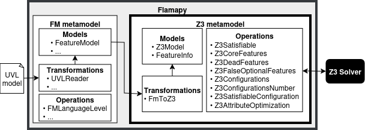

# Automated Analysis of UVL using Satisfiability Modulo Theories


## Description
This repository contains the plugin that supports z3 representations for feature models.

The plugin is based on [flamapy](https://flamapy.github.io/), and relies on the [Z3 solver](https://github.com/Z3Prover/z3?tab=readme-ov-file) library. The architecture is as follows:

<p align="center">
  
</p>


## Requirements and Installation
- [Python 3.11+](https://www.python.org/)
- [Flamapy](https://www.flamapy.org/)

The framework has been tested in Linux and Windows 11 with Python 3.12. Python 3.13+ may not be still supported.

### Download and installation
1. Install [Python 3.11+](https://www.python.org/).
2. Download/Clone this repository and enter into the main directory.
3. Create a virtual environment: `python -m venv env`
4. Activate the environment: 
   
   In Linux: `source env/bin/activate`

   In Windows: `.\env\Scripts\Activate`

5. Install dependencies (flamapy): `pip install -r requirements.txt`
     
    ** In case that you are running Ubuntu and get an error installing flamapy, please install the package python3-dev with the command `sudo apt update && sudo apt install python3-dev` and update wheel and setuptools with the command `pip  install --upgrade pip wheel setuptools` before step 5.


## Functionality and usage
The executable script [test.py](/test.py) serves as an entry point to show the plugin in action.

Simply run: `python test.py` to see it in action over the running feature model presented in the paper.

The following functionality is provided:


### Load a feature model in UVL and translate to SMT
```python
from flamapy.metamodels.fm_metamodel.transformations import UVLReader
from flamapy.metamodels.z3_metamodel.transformations import FmToZ3

# Load the feature model from UVL
fm_model = UVLReader('resources/models/uvl_models/Pizza_z3.uvl').transform()
# Transform the feature model to SMT
z3_model = FmToZ3(fm_model).transform()
```

### Analysis operations
The following operations are available:
```python
from flamapy.metamodels.z3_metamodel.operations import (
    Z3Satisfiable,
    Z3Configurations,
    Z3ConfigurationsNumber,
    Z3CoreFeatures,
    Z3DeadFeatures,
    Z3FalseOptionalFeatures,
    Z3AttributeOptimization,
    Z3SatisfiableConfiguration,
    Z3FeatureBounds,
    Z3AllFeatureBounds,
)
```

- **Satisfiable**

    Return whether the model is satisfiable (valid):
    ```python
    satisfiable = Z3Satisfiable().execute(z3_model).get_result()
    print(f'Satisfiable? (valid?): {satisfiable}')
    ```

- **Core features**

    Return the core features of the model:
    ```python
    core_features = Z3CoreFeatures().execute(z3_model).get_result()
    print(f'Core features: {core_features}')
    ```

- **Dead features**

    Return the dead features of the model:
    ```python
    dead_features = Z3DeadFeatures().execute(z3_model).get_result()
    print(f'Dead features: {dead_features}')
    ```

- **False-Optional features**

    Return the false-optional features of the model:
    ```python
    false_optional_features = Z3FalseOptionalFeatures().execute(z3_model).get_result()
    print(f'False-optional features: {false_optional_features}')
    ```    

- **Configurations**

    Enumerate the configurations of the model:
    ```python
    configurations = Z3Configurations().execute(z3_model).get_result()
    print(f'Configurations: {len(configurations)}')
    for i, config in enumerate(configurations, 1):
        config_str = ', '.join(f'{f}={v}' if not isinstance(v, bool) else f'{f}' for f,v in config.elements.items() if config.is_selected(f))
        print(f'Config. {i}: {config_str}')
    ```

- **Configurations number**

    Return the number of configurations:
    ```python
    n_configs = Z3ConfigurationsNumber().execute(z3_model).get_result()
    print(f'Configurations number: {n_configs}')
    ```

- **Boundaries analysis of typed features**

    Return the boundaries of the numerical features (Integer, Real, String) of the model:
    ```python
    attributes = fm_model.get_attributes()
    print('Attributes in the model')
    for attr in attributes:
        print(f' - {attr.name} ({attr.attribute_type})')
    
    variable_bounds = Z3AllFeatureBounds().execute(z3_model).get_result()
    print('Variable bounds for all typed variables:')
    for var_name, bounds in variable_bounds.items():
        print(f' - {var_name}: {bounds}')
    ```    

- **Configuration optimization based on feature attributes:**

    Return the set of configurations that optimize the given goals (i.e., the pareto front):
    ```python
    attribute_optimization_op = Z3AttributeOptimization()
    attributes = {'Price': OptimizationGoal.MAXIMIZE,
                  'Kcal': OptimizationGoal.MINIMIZE}
    attribute_optimization_op.set_attributes(attributes)
    configurations_with_values = attribute_optimization_op.execute(z3_model).get_result()
    print(f'Optimum configurations: {len(configurations_with_values)} configs.')
    for i, config_value in enumerate(configurations_with_values, 1):
        config, values = config_value
        config_str = ', '.join(f'{f}={v}' if not isinstance(v, bool) else f'{f}' for f,v in config.elements.items() if config.is_selected(f))
        values_str = ', '.join(f'{k}={v}' for k,v in values.items())
        print(f'Config. {i}: {config_str} | Values: {values_str}')
    ```    

- Configuration validation:

    Return whether a given partial or full configuration is valid:
    ```python
    from flamapy.metamodels.configuration_metamodel.transformations import ConfigurationJSONReader
    configuration = ConfigurationJSONReader('resources/configs/pizza_z3_config1.json').transform()
    configuration.set_full(False)
    print(f'Configuration: {configuration.elements}')
    satisfiable_configuration_op = Z3SatisfiableConfiguration()
    satisfiable_configuration_op.set_configuration(configuration)
    is_satisfiable = satisfiable_configuration_op.execute(z3_model).get_result()
    print(f'Is the configuration satisfiable? {is_satisfiable}')
    ```    

**Note:** The Z3Configurations and Z3ConfigurationsNumber operations may takes longer if the number of configuration is huge, or even not finish if the model is unbounded.

**Note:** The Z3Configurations and Z3ConfigurationsNumber operations support also a partial configuration as an additional argument, so the operation will return the result taking into account the given partial configuration. 
For example:

```python
from flamapy.core.models import Configuration
# Create a partial configuration
elements = {'Pizza': True, 'SpicyLvl': 5}
partial_config = Configuration(elements)
# Calculate the number of configuration from the partial configuration
configs_number_op = Z3ConfigurationsNumber()
configs_number_op.set_partial_configuration(partial_config)
n_configs = configs_number_op.execute(z3_model).get_result()
print(f'#Configurations: {n_configs}')
```